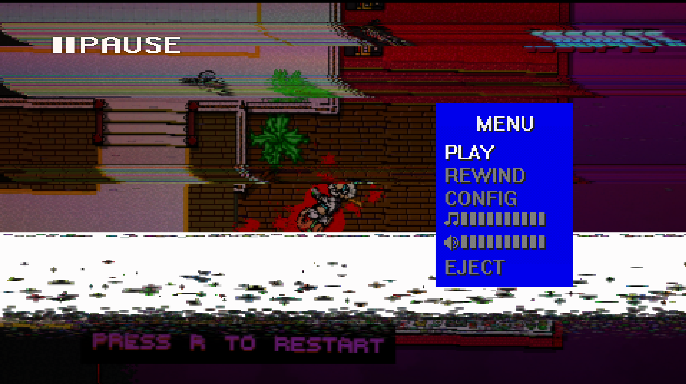

## 项目：Untitled
封面：[From](https://www.pixiv.net/artworks/134607427)

人员：我独自升级

目标：制作一份完整且独特的作品集，检验所学知识，并长期维护。

  或许我也只是想做点属于我自己的东西

项目灵感：游戏体验灵感来源于迈阿密热线（HotLine Maimi），希望继承该游戏快节奏，
高难度，强反馈的视觉效果及游戏体验。

“迈阿密热线是一款热血刺激、原始残暴的动作游戏，处处充斥激烈枪战和拳拳致命的近身战斗，仿佛下一秒头骨就会粉碎四溢。”
<iframe frameborder="no" border="0" marginwidth="0" marginheight="0" width=330 height=86 src="//music.163.com/outchain/player?type=2&id=31245056&auto=1&height=66"></iframe>

[迈阿密热线游戏截图](/picture/hotline/miami.jpg)

游戏核心：上帝视角运营，高速，高难，一击毙命与蒸汽波音乐配合的动作射击游戏。

游戏核心词；2D，良好地图设计，有限武器，像素画风，暴力血腥，强反馈视觉表现，迷幻风格与合成器音乐，快速重试，碎片叙事
（色彩相当浓烈的80年代风叙事）

关卡游玩思路大体如下：
- 游戏开始前选择面具，面具各拥有不同的初始效果，一旦进入门内或任务开始则进入战斗。
- 战斗开始玩家规划，观察地图敌人信息与敌人所携带武器（武器子弹有限），而后玩家决策行动策略
- 执行策略，随后不断尝试往复，游戏死亡后按下R即可复活
- 清扫完一层敌人后进入下一层，所有层数清空或接触任务目标即本关卡完成
- 概括讲即：死亡-学习-优化-成功
- 完成后总结关卡计分，随后进入剧情
- 重复以上步骤

障碍物设计
- 分为绝对障碍物，视觉透明障碍物，半高障碍物与可开关动态障碍物

依次介绍，墙体具有阻挡人物与射击效果，玻璃射击后被摧毁，被摧毁前可阻止一次射击但不阻挡视野，
半高障碍物仅阻挡移动，门具备墙体的性质，但可经由人物移动改变方向。

   **项目目标即是如何把这些转换到第一人称上**

  鉴于目前我所拥有的技术栈，画风与玩法上更相近的游戏我类比的是，**Shooter Ready与幽灵行者**

  选择Shooter Ready的原因是因为具备一些三渲二的技术，作为FPS有一些不错的设计思路可以借鉴一下。
  而幽灵行者则是不能射击+跑酷占比较大，可以说是近战3D的迈阿密，二者体验的快节奏感相似。

## Shooter Ready

就Ui设计而言，我打算大致改一下该游戏UI就拿来用，改ugui做的实用且绚丽

手部模型与武器的简单第一人称也足够了。

而在信息获取上，我认为最简单有效的方式就是**透视**

当玩家摁下E键时，墙壁与敌人透明化，以黑白处理二者区分度。加上冷却与时间限制，
模仿迈阿密的人物行事逻辑，再加上点脚步声，目前应该就这样了。

**先开做吧**

## 核心设计思路
- 一击毙命，高难度敌人，高速战斗

- 游戏将沿用与Shooter Ready相似的三渲二画风，
  就好这口三渲二
并采用迈阿密热线的暴力血腥感，（其实还有奇幻风），我认为SR的UI设计不错，去掉左下角的玩家头像
与人物属性展示,剩余时间，就能获得一个简洁明了的面板。
- 游戏将不包含敌人或玩家的说话声音，只保留脚步声与枪声，以提升氛围感。
- 游戏不包含升级系统，除非剧情需要，否则玩家选角必须一击毙命
- 游戏的体验正反馈在于玩家，不断尝试后达成的成就感，关卡达成后的分数带来的满足感，以及战斗时的掌控感与侵略感。
- 游戏BGM也极其重要，像这样的节奏型游戏，需要带感的音乐。这个纯粹的未知，游戏体验可以慢慢改。
  而音乐上我不知道能不能找到懂合成器浪潮等流派音乐的哥们。
- 游戏为了达成战斗的爽快感与刺激感，以及维护难度。我决定保留迈阿密热线的武器掉落与障碍物设计机制，对玩家火力进行限制，
3D与2D的感官差异巨大，上帝视角获取信息效率出奇的高，为了改善这一点。我设计的理念是：“玩家摁下E后可以进行透视，
- 游戏地图的设计应包含垂直与水平，障碍物分配与敌人分配视地图大小而定，以楼梯或电梯等通行道路，设计玩家与敌人的垂直玩法。
障碍物包括三个障碍，分为绝对障碍物，视觉透明障碍物，半高障碍物与可开关动态障碍物,场景中还应具有爆破物，玩家依据地形进行决策。
（场景与关卡设计上可以多看点儿电影，爱狗人士就有很多的长镜头）
- 游戏在灯光设计上，主题上亮度应该偏高，特殊环境再特殊设计
- 游戏的剧情播放逻辑会与迈阿密热线相似，在每个战斗关后，播放一节剧情。
- 游戏剧情待定
透视视角下敌人与场景黑白网格化区分，并提升移动速度。每一关卡开始时，玩家会拥有2S的初始时间，每当玩家进行击杀时，获取透视时间进行奖励”
- 游戏每一关卡结束时，都会对玩家的操作进行分数统计。比如通过的时间越短，时间一栏分数就越高，连杀分数倍数增加等。
- 游戏难度曲线设计上，前期的难度应当在玩家不进行透视也能通关的标准上。
- 而自己作为多年FPS玩家，什么是好的射击反馈我自认还是明白点的，好的设计非常多，就比如Apex的射击反馈，但这个比较抽象，我会在制作过程中慢慢摸索，怎么样的才是最好的。

## 关于制作流程
- 最基本的，先制作个实验场景，必须确保各个系统实打实的运行起来的才能考虑以上的所有想法，如果连开火都做不到，这一切都是空想。因此，我决定先进行最基本的脚本或者说系统设计，为每一个用得到的功能逐步写实现方法。
- 在脚本写完后，去找找好的资产与Shader，除非在进行招兵买马，不然只能我干完一切程序的活儿后自己造了。
- 功能与画面测试过后，直接去迈阿密热线中借鉴一张室内场景的地图，看看应用起来效果如何。
- 其余待定