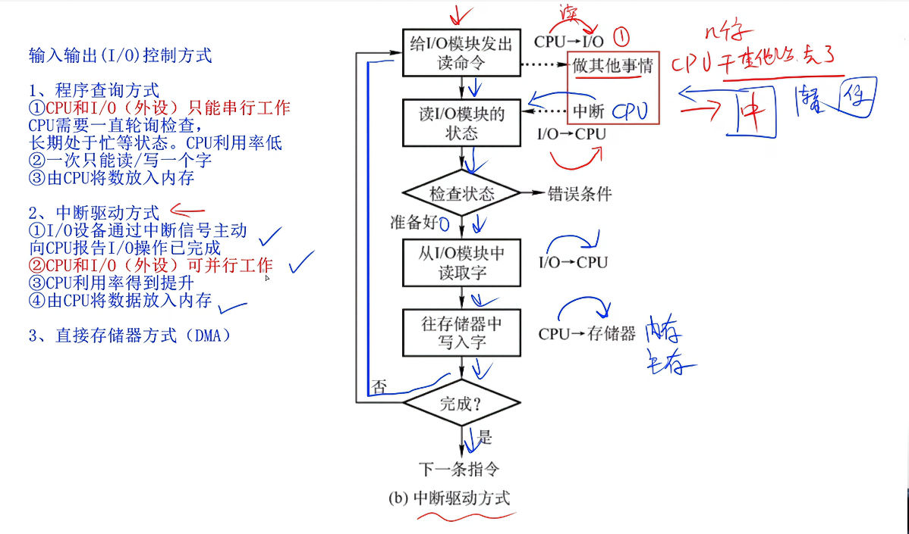

## 本文基于zst_2001的视频教学顺序进行的学习

## 进制及各码
上案例

## 进制计算与数据大小

地址最后位是什么进制，H是指16进制，A开始是10，且因为存储单元包含最后一位所以应该+1。
那么解题就很明朗了，0000A000-000C000间有多少单元，如果在不标记进制的情况下，那么默认
为10进制，所以直接进行一个转化，那么就是，13的16的三次幂-10的16的3次幂，在除个1024，结果为8K
所以选D。

| 类型 | 运算 | 结果 | 备注 |
|---|---|---|---|
| 原码表示 | +1 | 0 0000001 | |
| | -1 | 1 0000001 | |
| 反码表示 | +1 | 与原码相同 | |
| | -1 | 1 1111110 | |
| | (+0)反| 0 0000000 | |
| | (-0)反| 1 1111111 | |
| 补码表示 |+1 |与原码相同|最高位为符号位|
| | -1 | 1 1111111 |等于反码的末位+1|
| 移码表示 |+1 |1 0000001  | 是补码符号位取反的结果|
| | -1 | 0 1111111 | |

特性：补码的补码是原码（n是阶数）
，这里出题就只能硬背了

(二进制是B,八进制O,十进制D，十六进制H)

试题：
90h = 1001 0000补,再进行一次补码以获取原码，1111 0000，算个值结果为-112，除2得结果选C，
技巧上看，看到符号就选C会更快。

## 浮点数与规范化浮点数

$a^{2} + b^{2} = c^{2}$（如何写次方数）

浮点数一般表现形式 E = 2^{E} * F（右侧指的是E的二次方）;

浮点数参与计算应当先统一两个数的阶码，小阶向大阶对齐，同时将尾数右移n位
- 案例X = 0.1101 × 2³
二进制表示: 0 011 1101
(阶码是3，尾数是1101)
。Y = 0.1011 × 2¹
二进制表示: 0 001 1011
(阶码是1，尾数是1011)，直接进行移动

数值范围背诵
## 寻址（背诵）

## 校验码内容

**奇偶校验码**

在一组完整的二进制数据中，在数据末位加上一位校验码;
- 偶校验：确保整个数据中1的个数为偶数，如果已经是偶数，那么末位补0
-         如果是奇数，则补1来凑成偶数
- 奇校验；确保整个数据中1的个数为偶数，如果已经是偶数，那么末位补0
-         如果是偶数，则补1来凑成偶数
- **该方法点在于接收与发送方的要求**

## 海明码
利用码距来实现检错和纠错

**码距**
- A: 1 0 1 1 0
- B: 1 1 1 0 0
可以看到A是第二位不同，B是第四位不同，共有两位不同，所以两者码距为2；

设数据位为n位，校验位为k位，则n和k必须满足以下关系：
- 2的k次方-1 ≥ n + k；
- 码距 = 2，具备检验能力，码距 ≥ 3，才可能有纠错能力；

## 循环冗余校验码（CRC）

- K个数据位后跟r个校验位
- 采用模2运算

## RISC与CISC(精简指令集与复杂指令集计算机)
背诵内容

## 流水线公式与概念
- 流水线操作周期是最长时间段
- 吞吐率是最长流水段的操作时间（各段流水的操作时间不同）
 
计算题：

吞吐率计算方式为：总的指令数量除以N条指令的执行时间+（n-1）*最长时间段，结果显而易见，直接选B就行

- （3 + 2 + 4）*T *10=90t，选C
- （3 + 2 + 4）+ 9 *4 = 45t，选D

## 存储器

## 相联存储器按内容分布
闪存就U盘

## Cache与Cache地址映射

- 要是考地址的话，就直接背硬件自动完成吧

## 补充9-17日的笔记
- 中断的意义：暂停当前任务，转去完成其他任务，处理完毕后返回原程序；

## 输入输出控制方式（即I/O(INPUT/OUTPUT))
- 此任务分为三种

- PS:这玩意儿也是所有FPS玩家都厌恶的DMA外挂

- 考题内容一般是以上形式，直接考内容，所以直接选择C:

## 放弃总线内容，难考且分值只占一分，不值得

## 加密，摘要，数字签名与数字证书
- 为防止窃听，篡改，假冒，否认以进行加密
- 该部分内容可能会比较绕，但理解了过程就会变得简单
- 公钥公开分发,是用来验证真伪，验证真实性的钥，公钥验证签名来保障安全
- 私钥绝对保密，解密数据，做数字签名
- 数字证书由机构CA签发，将公钥与实体身份进行绑定，解决公钥的信任问题
- 数字签名消息摘要使用发送方私钥进行加密，使消息不可否认

明显AB

## 加密算法

- MD5是摘要算法，结果长度为128位
- 依然是幽默背诵题

## 可靠性公式

- 
- 
- 算法极其简单，有并联就算并联，算完后，将并联当串联算

## 明天做一下计算机系统的总结