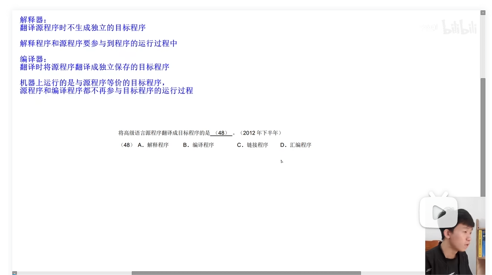
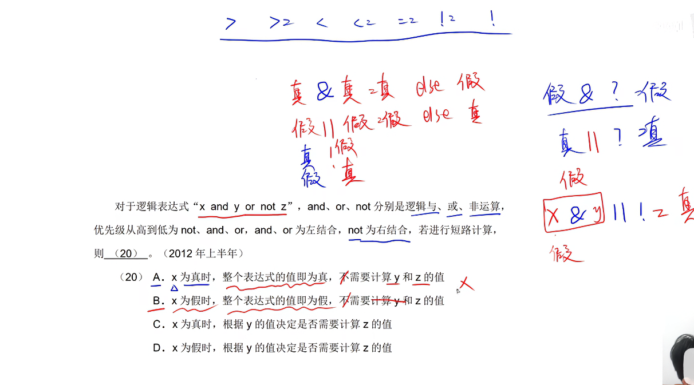
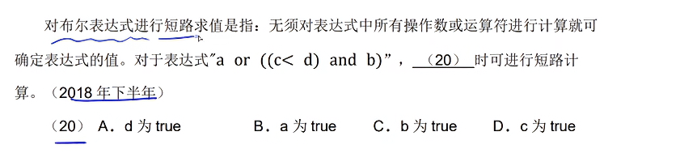
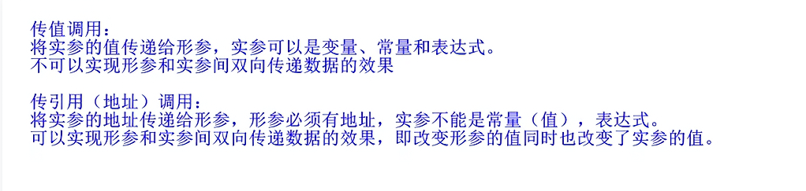
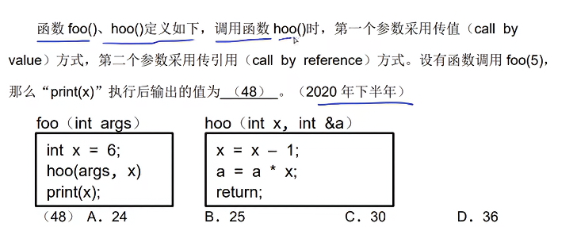
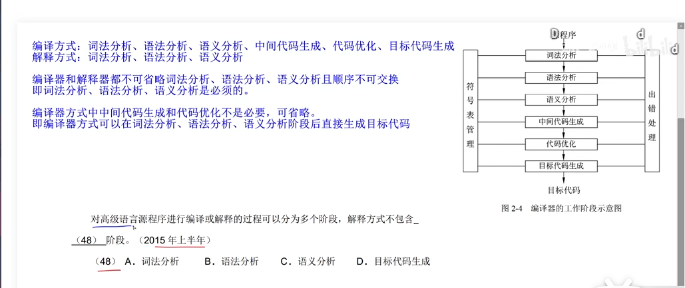
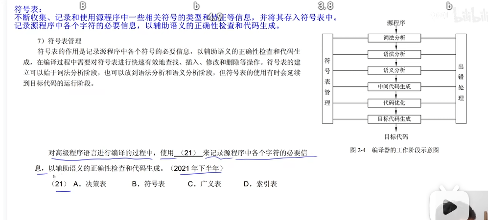

## 本文基于zst_2001的视频教学顺序进行的学习

**关于上一章节提到的总结，我打算单独立一个项出来，一起写到杂题汇总中**

## 编译程序和解释程序
- 我平常使用的编程语言（C#），被称为高级语言，而机器编码只能识别0与1，这时候为了让电脑识别出我们
打出的指令，比如public int Xide = 1314，那么就必须进行转换，这个过程有两种解释方法，至于差别，
只需要了解蓝字部分即可，一样是需要背诵的题目。

## 程序设计语言基本成分
- 程序的三种基本结构：顺序，选择和重复。

而至于这样的题，直接想一想C#的逻辑运算符，短路计算只需要满足其一即可进行，第一题选C，第二题选B。

## 传值调用与传地址调用
- 在我看来，局部变量（形式参数）就是指函数中命名的变量，被用作传值调用，就是参与计算，被用作地址
调用就是参与计算并改变实参（实参指的是全局变量）

zst牢大给的定义

- 计算解法：第一个参数为传值，第二个为传引用，由题可知args = 5，在foo方法中，可以看到 int x
= 6，那么hoo（args，x），就是hoo（5,6），进入hoo方法中。看到hoo拥有&a，那么X = A = 6,因为是传引用，所以X = 4，a =4 * 6;a = x = 24，故选A。

## 编译，解释程序
- 这部分没什么好说的，背诵

## 符号表
- 同上

## 词义，语法与语义分析

## 目标代码生成